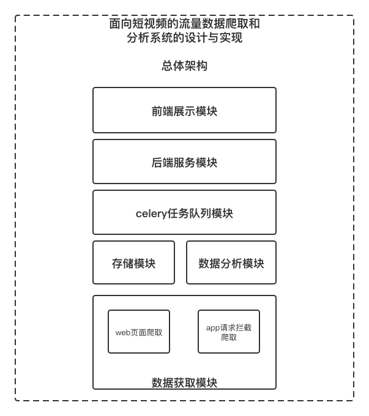
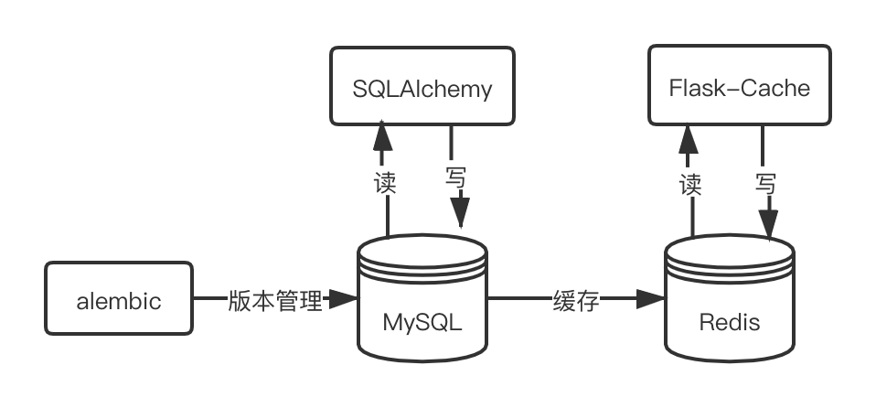
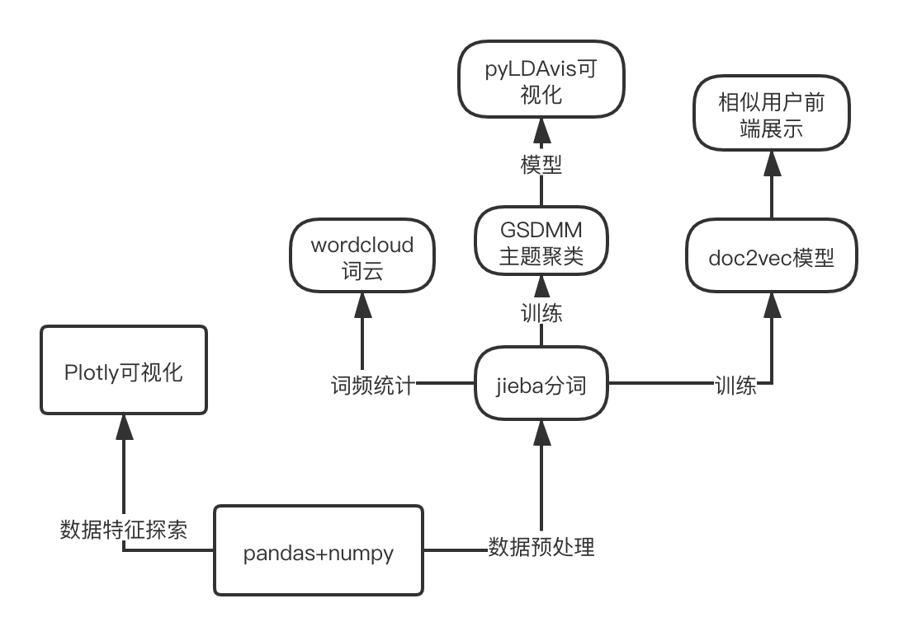
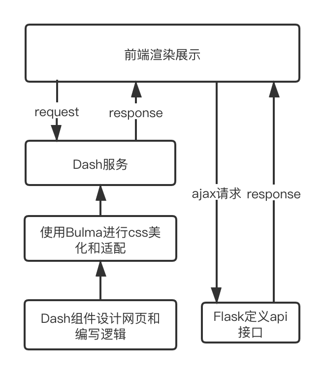

# Introduction

**此项目为本人毕设作品，设计实现了以抖音为数据源的短视频流量数据爬取和分析系统。**

## 系统演示

#### 1.系统首页


#### 2.在线爬取


#### 3.用户画像分析


## 系统设计概括

#### 1.系统架构图



#### 2. 爬虫模块

.png)

#### 3.数据存储模块



####4.数据挖掘模块



#### 5.web服务模块



## 项目目录

 - celery_app  
 后台任务模块，先启动该模块，再启动app  
 
 ```celery -A celery_app.tasks worker --loglevel=info```
 
 - db/  
 存放数据库模型
 
 - diggout/
 
 数据挖掘模块
 
 - douyin_alembic  
    alembic管理数据库

 - douyin_crawler  
    抖音用户分享链接web页面爬虫，”新榜“网页热门抖音号爬虫

 - supply  

    - proxy  
      mitmdump拦截抖音请求  

    - simulation  
      appium模拟操作

- svdca  
    web app模块  

    ```python svdca.index.py  ```